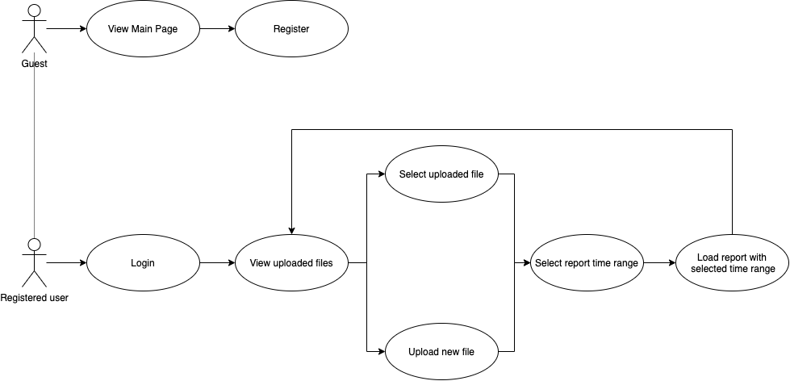
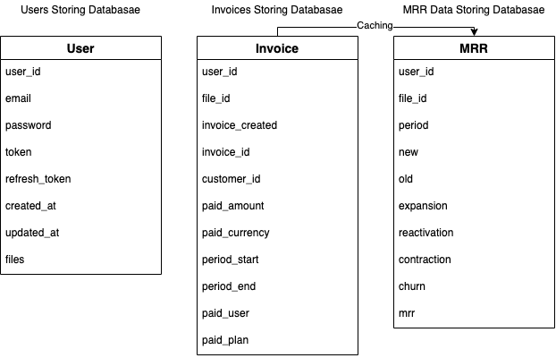

# remrratality

## Цель работы

Реализация системы вычисления MRR (Monthly Reccuring Revenue, регулярный месячный доход) в SaaS-приложениях.

Система решает проблему расчета и прогнозирования MRR, предоставляя возможность в графовом и табличном виде 
отобразить данные о доходах по месяцам.

## Функциональные требования

- Регистрация пользователей в системе
- Авторизация пользователей в системе
- Добавление и удаление файлов для аналитики
- Выбор периода для аналитики для загруженного файла
- Отображение аналитики в графовом и табличном представлениях

## Use-case диаграмма системы

## ER-диаграмма сущностей

