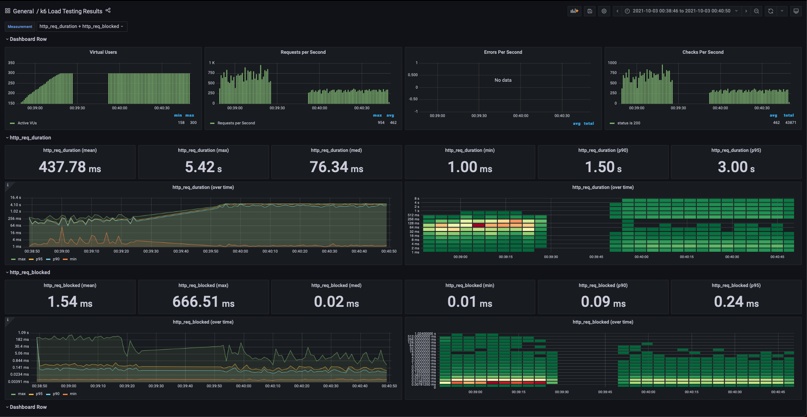
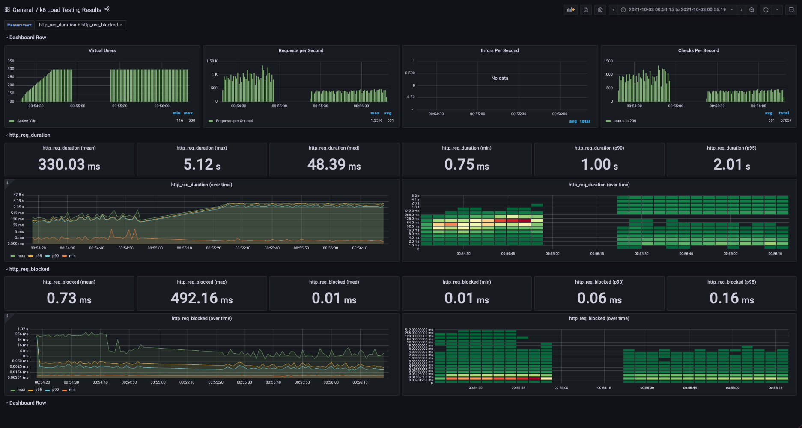

# remrratality

## Нагрузочное тестирование

### С тремя хостами и балансировкой 2:1:1

#### Вывод нагрузчика

```bash
docker-compose run k6 run /scripts/test.js
Creating remrratality_k6_run ... done

          /\      |‾‾| /‾‾/   /‾‾/   
     /\  /  \     |  |/  /   /  /    
    /  \/    \    |     (   /   ‾‾\  
   /          \   |  |\  \ |  (‾)  | 
  / __________ \  |__| \__\ \_____/ .io

  execution: local
     script: /scripts/test.js
     output: InfluxDBv1 (http://localhost:8086)

  scenarios: (100.00%) 2 scenarios, 300 max VUs, 2m0s max duration (incl. graceful stop):
           * getAnalytics: 15000.00 iterations/s for 1m0s (maxVUs: 100-300, exec: getAnalytics)
           * getFiles: 15000.00 iterations/s for 1m0s (maxVUs: 100-300, exec: getFiles, startTime: 1m0s)

WARN[0032] Insufficient VUs, reached 300 active VUs and cannot initialize more  executor=constant-arrival-rate scenario=getAnalytics
WARN[0063] Could not get a VU from the buffer for 400ms  executor=constant-arrival-rate scenario=getFiles
WARN[0064] Could not get a VU from the buffer for 800ms  executor=constant-arrival-rate scenario=getFiles
WARN[0065] Insufficient VUs, reached 300 active VUs and cannot initialize more  executor=constant-arrival-rate scenario=getFiles
ERRO[0075] Couldn't write stats                          error="{\"error\":\"Request Entity Too Large\"}\n" output=InfluxDBv1

running (2m00.1s), 000/300 VUs, 61633 complete and 411 interrupted iterations
getAnalytics ✓ [======================================] 007/300 VUs  1m0s  15000 iters/s
getFiles     ✓ [======================================] 300/300 VUs  1m0s  15000 iters/s

     ✓ status is 200

     checks.....................: 100.00% ✓ 61633       ✗ 0    
     data_received..............: 76 MB   636 kB/s
     data_sent..................: 27 MB   226 kB/s
     dropped_iterations.........: 1120996 9337.164216/s
     http_req_blocked...........: avg=1.15ms   min=5.95µs  med=17.33µs  max=666.5ms  p(90)=88.41µs  p(95)=251.15µs
     http_req_connecting........: avg=234.77µs min=0s      med=0s       max=282.97ms p(90)=0s       p(95)=0s      
     http_req_duration..........: avg=349.11ms min=1ms     med=86.95ms  max=5.41s    p(90)=524.02ms p(95)=2s      
     http_req_failed............: 0.00%   ✓ 0           ✗ 61633
     http_req_receiving.........: avg=1.07ms   min=45.29µs med=197.54µs max=474.51ms p(90)=1.31ms   p(95)=2.57ms  
     http_req_sending...........: avg=766.11µs min=24.45µs med=89.33µs  max=498.16ms p(90)=761.85µs p(95)=1.59ms  
     http_req_tls_handshaking...: avg=551.49µs min=0s      med=0s       max=503.07ms p(90)=0s       p(95)=0s      
     http_req_waiting...........: avg=347.26ms min=823.5µs med=85.32ms  max=5.41s    p(90)=519.93ms p(95)=2s      
     http_reqs..................: 61633   513.362619/s
     iteration_duration.........: avg=396.75ms min=1.57ms  med=140.48ms max=5.41s    p(90)=687.91ms p(95)=2s      
     iterations.................: 61633   513.362619/s
     vus........................: 300     min=66        max=300
     vus_max....................: 300     min=158       max=300
```

#### Дашборд Grafana



### С одним хостом и без балансировки

#### Вывод нагрузчика

```bash
docker-compose run k6 run /scripts/test.js
Creating remrratality_k6_run ... done

          /\      |‾‾| /‾‾/   /‾‾/   
     /\  /  \     |  |/  /   /  /    
    /  \/    \    |     (   /   ‾‾\  
   /          \   |  |\  \ |  (‾)  | 
  / __________ \  |__| \__\ \_____/ .io

  execution: local
     script: /scripts/test.js
     output: InfluxDBv1 (http://localhost:8086)

  scenarios: (100.00%) 2 scenarios, 300 max VUs, 2m0s max duration (incl. graceful stop):
           * getAnalytics: 15000.00 iterations/s for 1m0s (maxVUs: 100-300, exec: getAnalytics)
           * getFiles: 15000.00 iterations/s for 1m0s (maxVUs: 100-300, exec: getFiles, startTime: 1m0s)

WARN[0027] Insufficient VUs, reached 300 active VUs and cannot initialize more  executor=constant-arrival-rate scenario=getAnalytics
WARN[0064] Could not get a VU from the buffer for 400ms  executor=constant-arrival-rate scenario=getFiles
WARN[0064] Could not get a VU from the buffer for 800ms  executor=constant-arrival-rate scenario=getFiles
WARN[0064] Could not get a VU from the buffer for 1.2s   executor=constant-arrival-rate scenario=getFiles
WARN[0065] Could not get a VU from the buffer for 1.6s   executor=constant-arrival-rate scenario=getFiles
WARN[0066] Insufficient VUs, reached 300 active VUs and cannot initialize more  executor=constant-arrival-rate scenario=getFiles
ERRO[0079] Couldn't write stats                          error="{\"error\":\"Request Entity Too Large\"}\n" output=InfluxDBv1

running (2m00.1s), 000/300 VUs, 80787 complete and 488 interrupted iterations
getAnalytics ✓ [======================================] 125/300 VUs  1m0s  15000 iters/s
getFiles     ✓ [======================================] 298/300 VUs  1m0s  15000 iters/s

     ✓ status is 200

     checks.....................: 100.00% ✓ 80787        ✗ 0    
     data_received..............: 103 MB  858 kB/s
     data_sent..................: 36 MB   299 kB/s
     dropped_iterations.........: 1230457 10241.673994/s
     http_req_blocked...........: avg=541.86µs min=5.79µs   med=14.5µs   max=492.15ms p(90)=61µs     p(95)=167.17µs
     http_req_connecting........: avg=156.78µs min=0s       med=0s       max=286.46ms p(90)=0s       p(95)=0s      
     http_req_duration..........: avg=258.19ms min=753.87µs med=54.66ms  max=5.12s    p(90)=503.14ms p(95)=1.5s    
     http_req_failed............: 0.00%   ✓ 0            ✗ 80886
     http_req_receiving.........: avg=748.19µs min=47.83µs  med=153.62µs max=560.2ms  p(90)=930.16µs p(95)=1.7ms   
     http_req_sending...........: avg=536.46µs min=25.91µs  med=74.95µs  max=941.08ms p(90)=552.37µs p(95)=1.1ms   
     http_req_tls_handshaking...: avg=297.21µs min=0s       med=0s       max=423.28ms p(90)=0s       p(95)=0s      
     http_req_waiting...........: avg=256.91ms min=615.54µs med=53.65ms  max=5.12s    p(90)=502.45ms p(95)=1.5s    
     http_reqs..................: 80886   673.25233/s
     iteration_duration.........: avg=301.66ms min=1.24ms   med=103.33ms max=5.49s    p(90)=505.23ms p(95)=1.5s    
     iterations.................: 80787   672.428307/s
     vus........................: 300     min=100        max=300
     vus_max....................: 300     min=116        max=300
```

#### Дашборд Grafana


